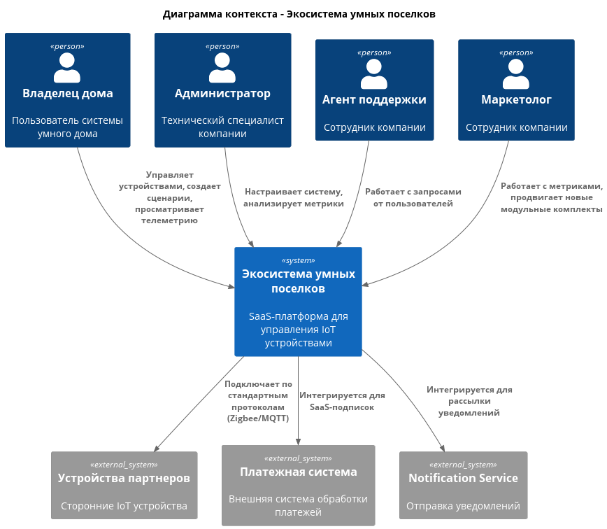
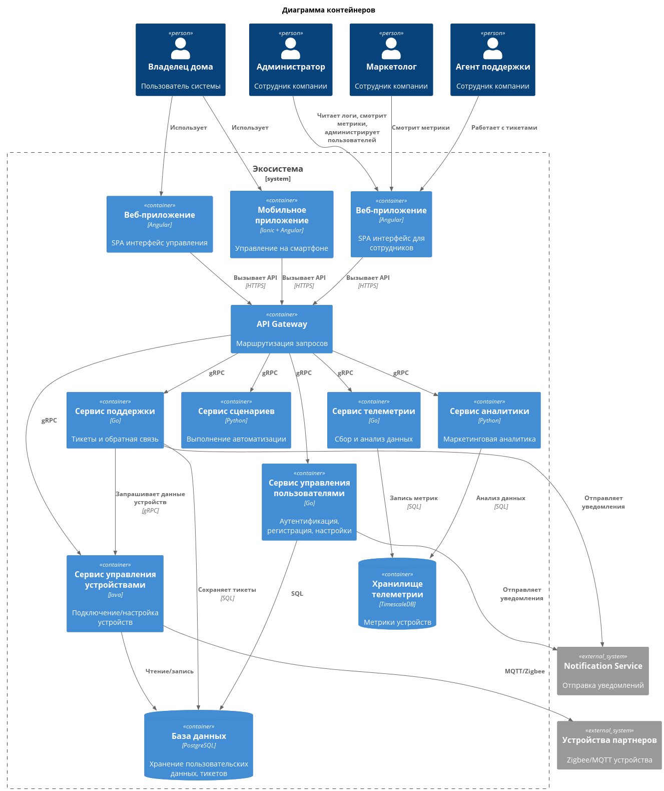
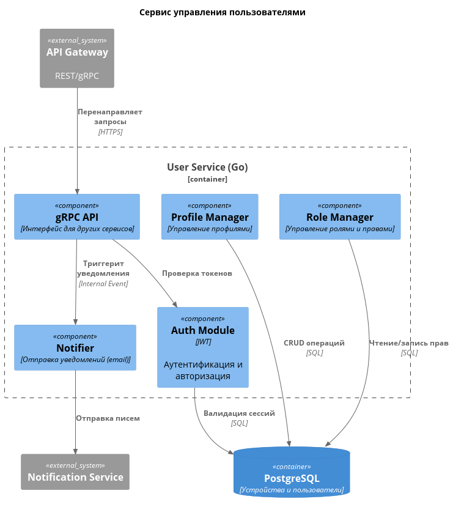
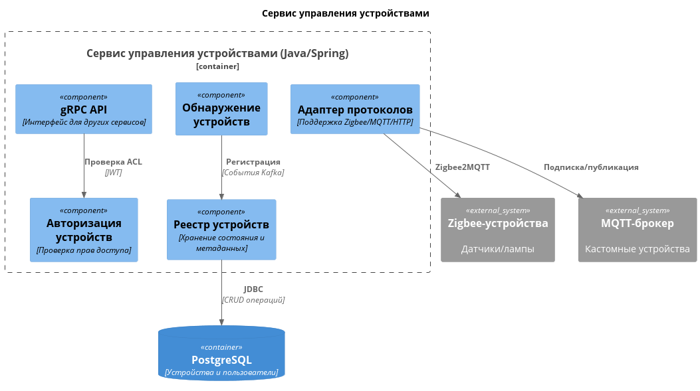
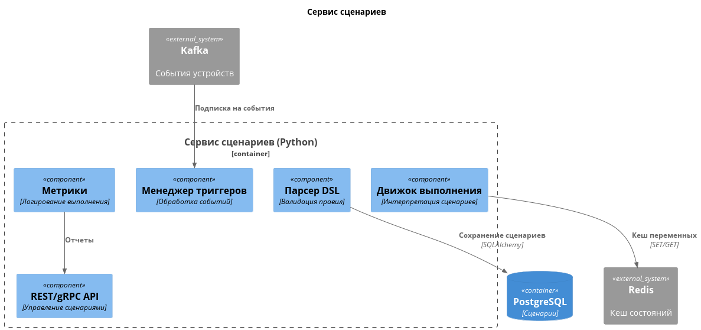
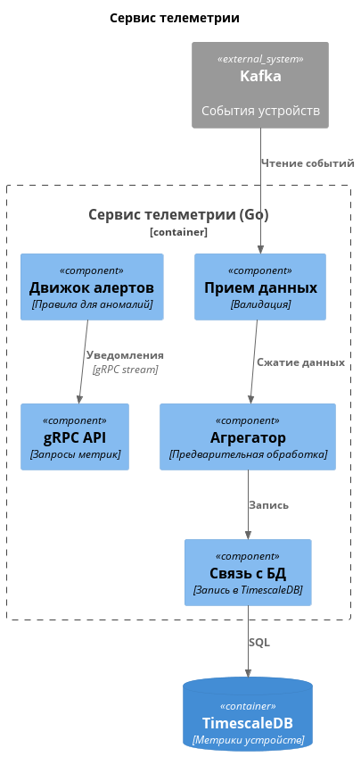
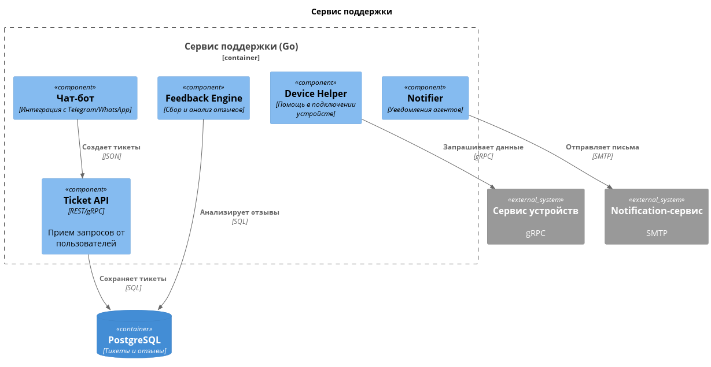
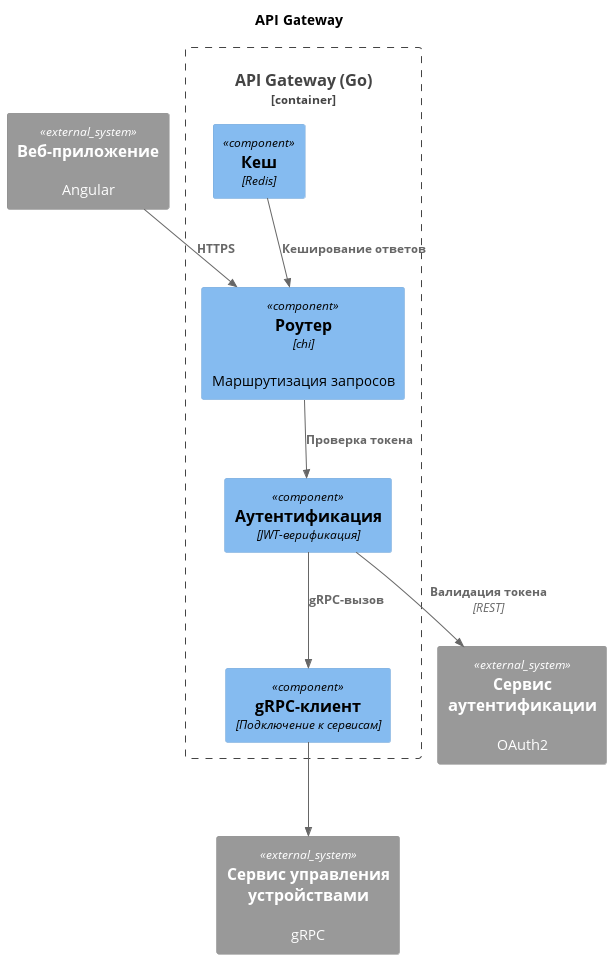
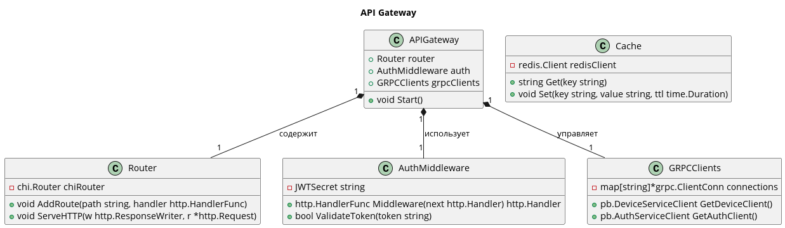

# Project_template

# Задание 1. Анализ и планирование

### 1. Описание функциональности монолитного приложения

**Управление отоплением:**

- Пользователи могут удалённо включать/выключать отопление в своих домах
- Пользователь не может самостоятельно подключить свой датчик к системе, требуется выезд специалиста

**Мониторинг температуры:**

- Пользователи могут просматривать текущую температуру в своих домах через веб-интерфейс
- Для получения данных о температуре нужно явно совершить запрос к серверу, так как все управление идет от сервера к датчику
- Система поддерживает сбор данных с датчиков температуры, установленных в домах, через синхронные запросы от сервера к датчикам

### 2. Анализ архитектуры монолитного приложения

- Язык программирования: Go
- База данных: PostgreSQL
- Предусмотрена контейнеризация при помощи Docker
- Данные о температуре запрашиваются со стороннего API
- Архитектура: Монолитная, все компоненты системы (обработка запросов, бизнес-логика, работа с данными) находятся в рамках одного приложения
- Взаимодействие: Синхронное, запросы обрабатываются последовательно
- Масштабируемость: Ограничена, так как монолит сложно масштабировать по частям
- Развертывание: Требует остановки всего приложения

### 3. Определение доменов и границы контекстов

#### As-Is:

- Домен "Экосистема умных поселков":

	- Поддомен "Управление отоплением"
		- Контекст: управление температурным значением датчика
		- Контекст: управление состоянием датчика (вкл\выкл)

	- Поддомен "Мониторинг температуры"
		- Контекст: просмотр данных о работе подключенных датчиков

	- Поддомен "Установка датчиков"
		- Контекст: добавление датчика в экосистему
		- Контекст: мониторинг данных датчика
		- Контекст: вывод датчика из эксплуатации

#### To-Be:

- Домен "Экосистема умных поселков":

	- Поддомен "Управление устройствами"
		
		- Контекст: поддержка стандартных протоколов
		- Контекст: подключение устройства по поддерживаем протоколам 
		- Контекст: просмотр и редактирование информации о подключенном устройстве
		- Контекст: удаление устройства

	- Поддомен "Управление сценариями автоматизации"
		
		- Контекст: программирование сценариев работы подключенных устройств
		- Контекст: просмотр и редактирование существующих сценариев
	
	- Поддомен "Телеметрия"
		
		- Контекст: объединение устройств в группы и определение отслеживаемых показателей
		- Контекст: сбор и хранение информации с входящих в одну группу устройств
		- Контекст: составление отчетности на основе собранных данных, визуализация

	- Поддомен "Поддержка и сопровождение"

		- Контекст: система тикетов, взаимодействие с пользователями экосистемы, помощь в подключении устройств
		- Контекст: получение обратной связи от пользователей экосистемы

	- Поддомен "Аналитика для маркетинга"

		- Контекст: сбор статистических данных
		- Контекст: визуализация собранных данных с целью выявления "болей" пользователей

	- Поддомен "Управление пользователями"

		- Контекст: регистрация и аутентификация пользователей в системе, восстановление доступа
		- Контекст: авторизация пользователей

	

### **4. Проблемы монолитного решения**

- Любое обновление требует перезапуска всего приложения
- Ошибка в работе одного компонента повлечет сбой во всем приложении
- Масштабировать можно только все приложение целиком
- Поддержка новых устройств требует изменений во всей кодовой базе
- Сложность работы над одной кодовой базой нескольким командам разработчиков

### 5. Визуализация контекста системы — диаграмма С4
[Диаграмма контекста](./docs/architecture/context/context.puml)

# Задание 2. Проектирование микросервисной архитектуры

[**Диаграмма контейнеров (Containers)**](./docs/architecture/container/container.puml)

**Диаграмма компонентов (Components)**

[Сервис управления пользователями](./docs/architecture/component/users.puml)

[Сервис управления устройствами](./docs/architecture/component/device-management.puml)

[Сервис управления сценариями](./docs/architecture/component/automation.puml)

[Сервис телеметрии](./docs/architecture/component/telemetry.puml)

[Сервис аналитики](./docs/architecture/component/analytics.puml)

[Сервис поддержки](./docs/architecture/component/support.puml)

[API Gateway](./docs/architecture/component/api-gateway.puml)

**Диаграмма кода (Code)**

[API Gateway](./docs/architecture/code/api-gateway.puml)

# Задание 3. Разработка ER-диаграммы

- [ERD](./docs/architecture/erd/erd.puml)

# Задание 4. Создание и документирование API

### 1. Тип API

Для взаимодействия микросервисов выбрал gRPC, так как он наиболее удобен для внутренней коммуникации, обеспечивает высокую производительность, поддержку потоковой передачи данных и строгую типизацию через Protocol Buffers.
(Я раньше не использовал этот подход, но постарался сообразить пару proto-контрактов)

Для взаимодействия с внешними клиентами выбрал REST из-за его простоты и совместимости с браузерами.

### 2. Документация API

- [Swagger](./docs/swagger/swagger.yml)
- [Device Service Proto](./protos/device_service.proto)
- [Telemetry Service Proto](./protos/telemetry_service.proto)

# Задание 5. Работа с docker и docker-compose

- Реализован простой http сервер на Go. 

